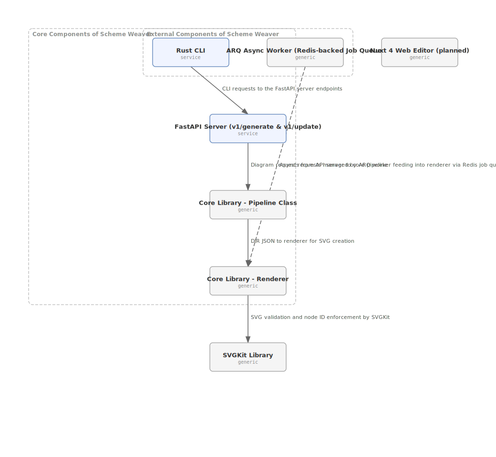

# Scheme Weaver

> **Turn prompts, screenshots, and code into clean, semantic SVGs.**

[](https://opensource.org/licenses/MIT)

---

## What Is It

Scheme Weaver is an AI pipeline that turns natural-language prompts into **production-ready, semantic SVGs** — architecture diagrams, ERDs, sequence diagrams, flowcharts, and more.

Outputs use proper `<g>` groups, semantic IDs, SVG primitives, and WCAG-ready ARIA labels — not spaghetti paths. Clean enough to open in Figma or Illustrator and keep editing.

**Complexity scaling is a first-class feature.** Every element in a diagram is tagged `low | medium | high`. Export a clean executive summary or a full engineering diagram from the same source — or embed all levels in one interactive SVG.

---

## How It Works

Claude never generates SVG directly. It generates a **Diagram Intermediate Representation (DIR)** — structured JSON describing nodes, edges, groups, and complexity levels. A deterministic renderer converts DIR → clean, semantic SVG.

```
Prompt → Claude → DIR (JSON) → Renderer → Semantic SVG → post-processing
```

The DIR is the source of truth. It's what the CLI saves, the API returns, the web editor loads, and future tools (VS Code extension, GitHub Action) will consume.

---

## Architecture

> This diagram is generated by Scheme Weaver itself — run `just diagram-self` to regenerate it.



---

## Features

- **Prompt → diagram** — describe what you want in plain English
- **Complexity scaling** — `low` (executive), `medium` (engineering), `high` (full detail) — all in one SVG
- **Semantic SVG output** — proper `<g>` groups, kebab-case IDs, `data-complexity`, `data-node-type`, full ARIA labels
- **Refine with feedback** — update an existing diagram by describing what changed
- **REST API** — self-hosted FastAPI backend, async-ready via ARQ + Redis
- **Rust CLI** — ships as a single binary, no runtime required
- **Post-processing** — a11y validation, semantic ID enforcement
- **Screenshot → wireframe** *(roadmap)*
- **Repo scan → architecture docs** *(roadmap)*
- **GitHub Action** *(roadmap)*
- **VS Code + PyCharm extensions** *(roadmap)*

---

## Quickstart

### Prerequisites

- Python 3.12+
- [`uv`](https://docs.astral.sh/uv/) — `pip install uv`
- An Anthropic API key
- Rust + Cargo (for the CLI binary) — [rustup.rs](https://rustup.rs)
- `just` (task runner) — `cargo install just`

### Setup

```bash
git clone https://github.com/your-org/schemeweaver
cd schemeweaver

cp .env.example .env
# edit .env — add your ANTHROPIC_API_KEY

uv sync          # install all Python dependencies
cargo fetch      # prefetch Rust dependencies
```

### Run the API server

```bash
just dev-server
# → http://localhost:8000
# → http://localhost:8000/docs  (Swagger UI)
```

### Generate a diagram via curl

```bash
curl -s -X POST http://localhost:8000/v1/generate \
  -H "Content-Type: application/json" \
  -d '{"prompt": "AWS architecture with API Gateway, Lambda, RDS, and S3"}' \
  | python3 -c "import sys,json; print(json.load(sys.stdin)['svg'])" \
  > diagram.svg
```

Or use the justfile shortcut:

```bash
just generate prompt="AWS architecture with API Gateway, Lambda, RDS, and S3"
```

### Generate with a specific complexity level

```bash
# Executive summary (low complexity only)
curl -s -X POST http://localhost:8000/v1/generate \
  -H "Content-Type: application/json" \
  -d '{"prompt": "three-tier web app", "complexity": "low"}' \
  | python3 -c "import sys,json; print(json.load(sys.stdin)['svg'])" \
  > summary.svg

# Full detail (all levels interactive)
curl -s -X POST http://localhost:8000/v1/generate \
  -H "Content-Type: application/json" \
  -d '{"prompt": "three-tier web app"}' \
  | python3 -c "import sys,json; print(json.load(sys.stdin)['svg'])" \
  > interactive.svg
```

### Refine an existing diagram

```bash
curl -s -X POST http://localhost:8000/v1/update \
  -H "Content-Type: application/json" \
  -d '{
    "dir": <paste DIR JSON here>,
    "feedback": "add a Redis cache between the API and database"
  }' \
  | python3 -c "import sys,json; print(json.load(sys.stdin)['svg'])" \
  > updated.svg
```

### Build and use the CLI

```bash
just build-cli
# binary at: target/release/schemeweaver[.exe]

# Generate a diagram
./target/release/schemeweaver generate \
  --prompt "AWS architecture with Lambda, S3, and RDS" \
  --output diagram.svg \
  --save-dir          # also saves diagram.dir.json alongside

# Generate at a specific complexity level
./target/release/schemeweaver generate \
  --prompt "microservices with API gateway" \
  --detail medium \
  --output arch.svg

# Machine-readable JSON output
./target/release/schemeweaver --output json generate \
  --prompt "simple web app" \
  | jq .dir

# Update an existing diagram
./target/release/schemeweaver update diagram.dir.json \
  --feedback "added Redis cache between API and database"
```

---

## API Reference

### `POST /v1/generate`

Generate a new diagram.

**Request:**
```json
{
  "prompt": "AWS architecture with Lambda, S3, and RDS",
  "context": "Optional extra context",
  "complexity": "low" | "medium" | "high" | null
}
```

- `complexity: null` (default) — returns an interactive SVG with all levels embedded and CSS toggling
- `complexity: "low"` — static SVG with only low-complexity elements visible

**Response:**
```json
{
  "svg": "<svg ...>...</svg>",
  "dir": { ... },
  "issues": ["list of a11y warnings if any"]
}
```

### `POST /v1/update`

Refine an existing diagram using feedback.

**Request:**
```json
{
  "dir": { ... },
  "feedback": "add a Redis cache between API and database",
  "complexity": null
}
```

**Response:** same as `/v1/generate`

### `GET /health`

```json
{ "status": "ok", "service": "schemeweaver" }
```

---

## SVG Output Format

Every generated SVG follows consistent conventions:

```xml
<svg role="img" aria-label="Diagram: My Architecture"
     data-sw-version="1.0" data-diagram-type="architecture">

  <title>My Architecture</title>
  <desc>Optional description</desc>

  <defs>
    <!-- Complexity CSS: .complexity-high { display: none; } by default -->
    <!-- Arrow marker -->
  </defs>

  <!-- Groups (bounding boxes, rendered behind nodes) -->
  <g id="group-vpc" class="sw-group complexity-medium"
     data-complexity="medium" aria-label="Group: VPC">
    <rect ... stroke-dasharray="6,3" />
    <text>VPC</text>
  </g>

  <!-- Edges -->
  <g id="edge-lambda-to-rds" class="sw-edge complexity-medium"
     data-complexity="medium" aria-label="queries: lambda to rds">
    <line ... marker-end="url(#sw-arrow)" />
    <text>queries</text>
  </g>

  <!-- Nodes -->
  <g id="node-api-gateway" class="sw-node complexity-low"
     data-complexity="low" data-node-type="aws.api_gateway"
     aria-label="API Gateway: Entry point for all requests" role="group">
    <rect rx="6" fill="#fff3cd" stroke="#f0ad4e" />
    <text class="sw-node-label">API Gateway</text>
    <text class="sw-node-type">aws.api_gateway</text>
  </g>

</svg>
```

**Toggling complexity in the browser:**

```js
// Show only low + medium complexity elements
document.querySelectorAll('.complexity-high').forEach(el => el.style.display = 'none');
document.querySelectorAll('.complexity-medium').forEach(el => el.style.display = 'block');
```

---

## Repo Structure

```
schemeweaver/
├── apps/
│   ├── web/              ← Nuxt 4 + Vue 3 editor (coming soon)
│   └── cli/              ← Rust CLI (single binary)
├── apis/
│   └── server/           ← FastAPI backend
├── jobs/
│   └── worker/           ← ARQ async worker (Redis-backed)
├── libs/
│   ├── core/             ← Python: Claude pipeline, DIR models, SVG renderer
│   └── svgkit/           ← Python: a11y validation, semantic ID utilities
├── schema/
│   └── dir.schema.json   ← DIR JSON Schema (source of truth)
├── justfile              ← Cross-language task runner
├── pyproject.toml        ← uv workspace root
├── Cargo.toml            ← Cargo workspace root
└── package.json          ← pnpm workspace root
```

---

## Tech Stack

| Layer | Technology |
|---|---|
| AI backbone | Claude (Anthropic) — swappable for StarVector / OmniSVG |
| Core pipeline | Python 3.12, Pydantic v2 |
| Backend API | FastAPI + uvicorn |
| Async jobs | ARQ + Redis |
| CLI | Rust (clap, reqwest, indicatif) |
| Web editor | Nuxt 4 + Vue 3 *(coming soon)* |
| Package manager | uv (Python), Cargo (Rust), pnpm (Node) |
| Task runner | just |

---

## Development

```bash
just test          # run all tests (Python + Rust)
just test-python   # pytest only
just lint          # ruff + clippy + eslint
just fix           # auto-fix lint issues
just dev           # start server + worker together
just dev-server    # FastAPI on :8000 with hot reload
just dev-worker    # ARQ worker watching for jobs
```

---

## Roadmap

- [x] Core pipeline: Claude → DIR → semantic SVG
- [x] Complexity scaling (`low | medium | high`) embedded in SVG
- [x] REST API (`/v1/generate`, `/v1/update`)
- [x] Rust CLI (`generate`, `update`)
- [x] ARQ async worker scaffold
- [ ] Nuxt 4 web editor with interactive complexity slider
- [ ] `scan` — repo → architecture diagram
- [ ] `vectorize` — screenshot → SVG wireframe
- [ ] Multi-pass agentic refinement loop
- [ ] GitHub Action
- [ ] VS Code extension
- [ ] PyCharm plugin
- [ ] Figma plugin
- [ ] Shell completions
- [ ] Community fine-tuning dataset & benchmarks

---

## Contributing

Pull requests welcome. See `CONTRIBUTING.md` for guidelines.

---

## License

MIT © 2026 Scheme Weaver contributors.
